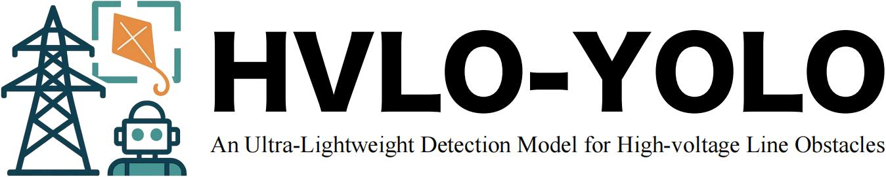

<p align="center">
  
</p>

**Official PyTorch implementation of "HVLO-YOLO: An Ultra-Lightweight Detection Model for High-voltage Line Obstacles"**

---

## 🚀 Highlights

- ✅ **Ultra-Lightweight:** Only **1.0M** parameters and **2.2MB** model size.
- ⚡ **Fast & Efficient:** Achieves **89.9% mAP50** with just **2.3 GFLOPs**.
- 📦 **Modular Design:** Three novel modules — `CP4`, `PDown`, and `PDetect`.
- 🛰️ **Field-oriented:** Designed for drone-based high-voltage obstacle detection.
- 🔁 **Generalizable:** Performs competitively on general datasets like COCO.

---

## 🔧 Installation

```bash
# Clone the repository
git clone https://github.com/JEFfersusu/HVLO-YOLO.git
cd HVLO-YOLO

# (Optional) Create virtual environment
python -m venv venv
source venv/bin/activate  # On Windows: venv\Scripts\activate

# Install dependencies
pip install ultralytics
```

---

## 📦 High-Voltage Line Obstacle Dataset

**Download from:** [https://aistudio.baidu.com/datasetdetail/223069](https://aistudio.baidu.com/datasetdetail/223069)

---

## 🔨 Usage

### 1. Training

```bash
yolo task=detect mode=train data=cfg/datasets/HVLOD.yaml model=cfg/models/v8/HVLO-YOLO.yaml epochs=300 batch=8
```

### 2. Inference

```bash
yolo task=detect mode=predict source=datasets model=HVLO-YOLO.pt

```

## 📊 Benchmark Results

### 🛠 High-voltage Line Obstacle Dataset

| Model | Model Siez (MB) | Params (M) | FLOPs (G) | mAP50 (%) | mAP50:95 (%) |
|-------|------------|------------|-----------|-----------|--------------|
| YOLOv8-n | 6.3 | 3.0 | 8.1 | 84.6 | 63.1 |
| YOLOv10-n | 5.8 | 3.0 | 8.2 | 82.8 | 62.8 |
| **HVLO-YOLO** | **2.2** | **1.0** | **2.3** | **89.9** | **67.6** |


## 📜 Citation

If you find this work helpful, please cite:

```bibtex
@article{your_hvloyolo_2025,
  title={HVLO-YOLO: An Ultra-Lightweight Detection Model for High-voltage Line Obstacles},
  author={Pan, Weichao and Wang, Xu and Lv, Chengze and Lin, Zicheng and Wang, Gongrui and Zhang, Xuening and Sun, Yi and Liu, Xingbo},
  journal={BMVC},
  year={2025}
}
```

## 🙌 Acknowledgements

This project is inspired by the open-source efforts of YOLO, [Ultralytics](https://github.com/ultralytics/ultralytics/tree/main), and PyTorch. We thank all contributors in the community.

## 📬 Contact

For questions, feel free to reach out:

- 📧 Weichao Pan (panweichao01@outlook.com)
